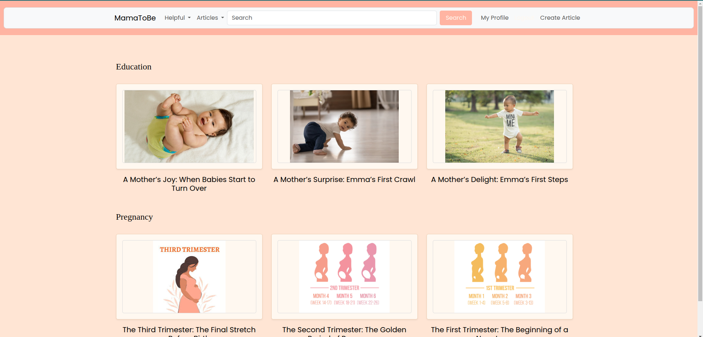
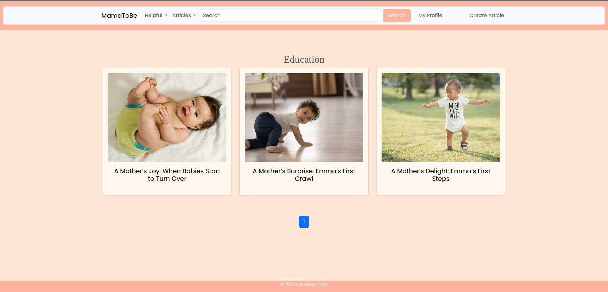
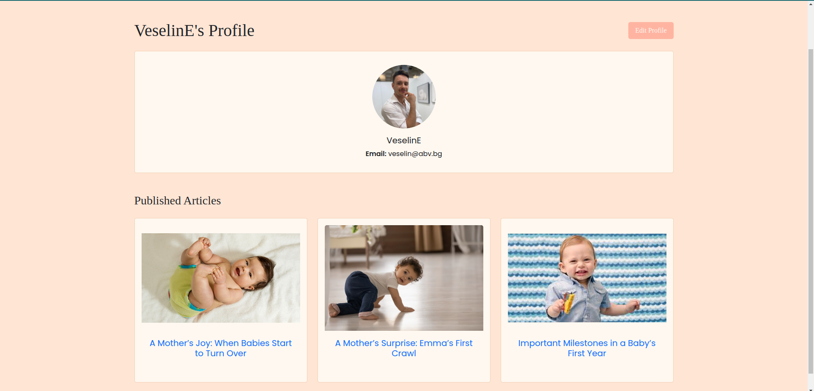

# Mama-To-Be
is my final project made for my Python Web-Development curriculum. As my wife was very pregnant at the moment
I figured I can make a project that she can adapt into something like an overengineered blog that can bring some
value to to-be-mothers.
Project is still in production, and will be deployed if I decide that the 'final' result is of value

# Home View
The last three articles of any category are displayed on the home page.

# Category View
The last nine articles are displayed when clicking on any of the categories or opened through the falling menus.

# Profile View
There is a registration/login functionality which restricts some of the views/site functionalities to specific 
user categories.

